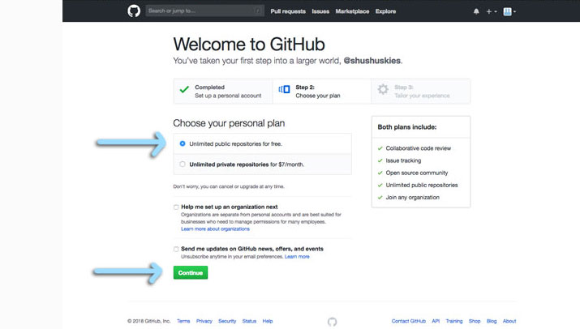

### 2019 Summer Code Camp
# Web Design

#### Monday

###### Opening Videos

###### Getting Started with GitHub Pages

***

### Getting started with GitHub Pages
#### **Create** a *[GitHub](https://github.com)* account

> [https://github.com](https://github.com)

> When you create your account

> you'll have a few things to **fill out**

> On the next page, you can **fill** these out

> or just **click** *skip this step* at the bottom.

***

> - [next](monday-getting-01.md)

- [ ] Go to your Profile
- [ ] You should see...
- [ ] Create and Initialize a New Repository
- [ ] Confirm you're in your repository
- [ ] Go to the Settings of your Repository
- [ ] Enable Github Pages
- [ ] Confirm your GitHub Page is working!
- [ ] Edit the README.md file
- [ ] Add a theme
- [ ] Try viewing your GitHub page again
- [ ] Think about Design

***

###### Intro to HTML

***
