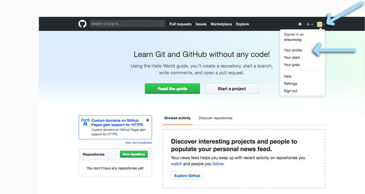

### 2018 Summer Code Camp
# Web Design

#### Monday

###### Opening Videos

###### Getting Started with GitHub Pages
- [x] Create a GitHub Account
- [x] Go to your Profile

***

### Getting started with GitHub Pages
#### **Go** to your Profile

> At the top of the page you should see a dark bar

> it contains several links, and at the far right

> it includes a little square with a white triangle pointing down.

> **Click** the *white triangle*

> **Click** *Your Profile*

***

> - [next](monday-getting-02.md)

- [ ] You should see...
- [ ] Create and Initialize a New Repository
- [ ] Confirm you're in your repository
- [ ] Go to the Settings of your Repository
- [ ] Enable Github Pages
- [ ] Confirm your GitHub Page is working!
- [ ] Edit the README.md file
- [ ] Add a theme
- [ ] Try viewing your GitHub page again.

***

###### Intro to HTML

***
