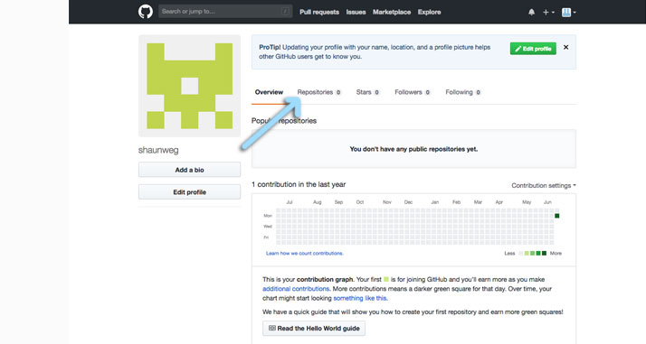
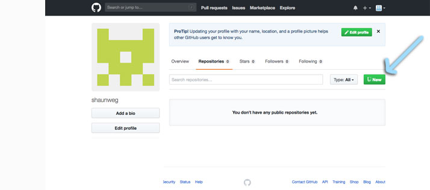
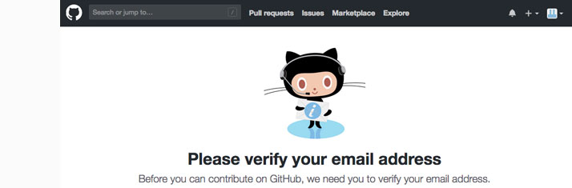
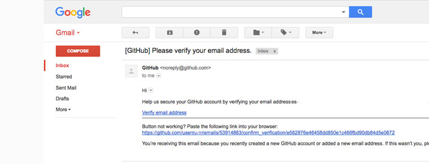
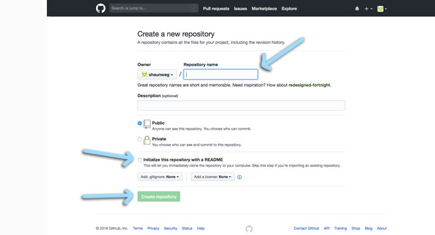

### 2018 Summer Code Camp
# Web Design

#### Monday

###### Opening Videos

###### Getting Started with GitHub Pages
- [x] Create a GitHub Account
- [x] Go to your Profile
- [x] You should see...
- [x] Create and Initialize a New Repository

***

### Getting started with GitHub Pages
#### **Create** and **Initialize** a New Repository

> In the content on the right

> in the horizontal menu, **click** repositories

> then **click** the green "New" button

***

> If you haven't confirmed your email address with GitHub...

> You'll get a notification to do so now.

> Login to your email, and you should see someting similar.

> After clicking the confirmation link, it'll take you to a new page

> This is the *Emails* section of the *Settings*

> If this happens to you:
> - **naigate** to your *Profile*, and then
> - **click** *Repositories*, and then
> - **click** *New*.

***

> **Choose** a name, I used "hello-web" as mine
> - If you aren't sure what to call yours, you can use the same name

> **Add** a *description*

> *Public* is fine, *private* requires a subscription

> **Click** the checkbox to *Initialize this repository*
> - This isn't required, you can manually do it, but its a lot more work
> - Lets do it the easier way.

***

> - [next](monday-getting-04.md)

- [ ] Confirm you're in your repository
- [ ] Go to the Settings of your Repository
- [ ] Enable Github Pages
- [ ] Confirm your GitHub Page is working!
- [ ] Edit the README.md file
- [ ] Add a theme
- [ ] Try viewing your GitHub page again.

***

###### Intro to HTML

***

