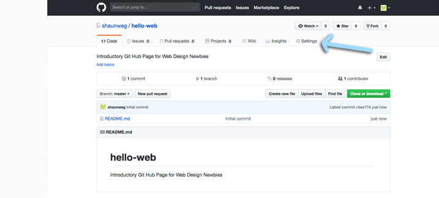

### 2019 Summer Code Camp
# Web Design

#### Monday

###### Opening Videos

###### Getting Started with GitHub Pages
- [x] Create a GitHub Account
- [x] Go to your Profile
- [x] You should see...
- [x] Create and Initialize a New Repository
- [x] Confirm you're in your repository

***

### Getting started with GitHub Pages
#### Go to the Settings of your Repository
> In the horizontal menu below your username and repository name, **click** *Settings*

***

> - [next](monday-getting-06.md)

- [ ] Enable Github Pages
- [ ] Confirm your GitHub Page is working!
- [ ] Edit the README.md file
- [ ] Add a theme
- [ ] Try viewing your GitHub page again
- [ ] Think about Design

***

###### Intro to HTML

***
