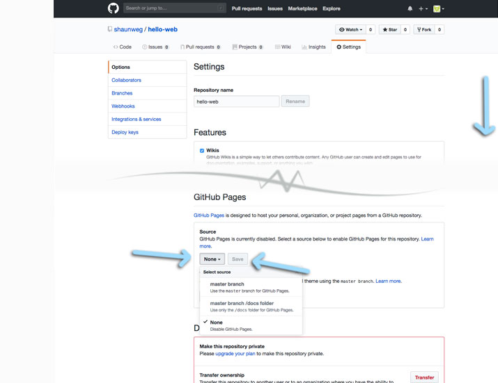

### 2019 Summer Code Camp
# Web Design

#### Monday

###### Opening Videos

###### Getting Started with GitHub Pages
- [x] Create a GitHub Account
- [x] Go to your Profile
- [x] You should see...
- [x] Create and Initialize a New Repository
- [x] Confirm you're in your repository
- [x] Go to the Settings of your Repository

***

### Getting started with GitHub Pages
#### Enable Github Pages
> You'll find it toward the bottom of the page.

> To enable, **click** the button that reads *None*, and change it to *master branch*.

> **Click** the *Save* button next to it

***

> - [next](monday-getting-07.md)

- [ ] Confirm your GitHub Page is working!
- [ ] Edit the README.md file
- [ ] Add a theme
- [ ] Try viewing your GitHub page again
- [ ] Think about Design

***

###### Intro to HTML

***
