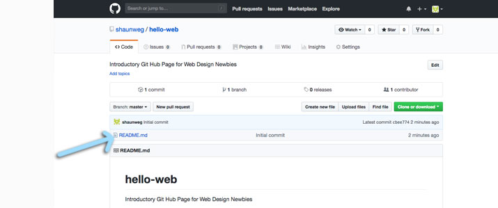
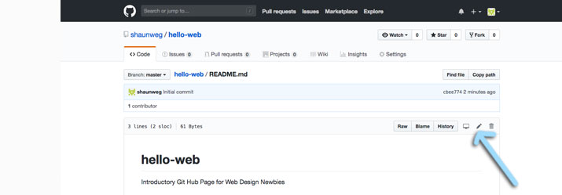
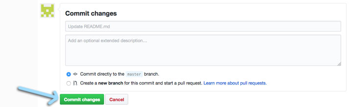

### 2019 Summer Code Camp
# Web Design

#### Monday

###### Opening Videos

###### Getting Started with GitHub Pages
- [x] Create a GitHub Account
- [x] Go to your Profile
- [x] You should see...
- [x] Create and Initialize a New Repository
- [x] Confirm you're in your repository
- [x] Go to the Settings of your Repository
- [x] Enable Github Pages
- [x] Confirm your GitHub Page is working!

***

### Getting started with GitHub Pages
#### Edit the README.md file
> To do this, you need to **go back** to your *repository page*
> - the URL for mine is: [https://github.com/shaunweg/hello-web](https://github.com/shaunweg/hello-web)
> - Yours should be similar

***
> **Click** the *README.md* file name that is in blue

> On the page that loads, a few lines down,

> you should see a horizontal content bar that says the # of lines, the # of bytes,

> and on the far right, there's a few buttons and icons.

***
> **Click** the *pencil* icon.

> You can see the page is created with very little information.

> This file uses *Markdown*, thats what the *.md* in the *file name* stands for

> Try **adding** some new lines of text to the *Markdown* file.

#### Working with and Learning MarkDown
> The following videos will help show you how to work with MarkDown to create your WebPages and WebSites. As you watch, pause and try out the different things I'm showing you.

[Working with a MarkDown Editor](https://youtu.be/peQprAGUcrs)  
[How to Use this Course](https://youtu.be/rY81zSOhn0g)

[Text & Paragraphs with Markdown](https://youtu.be/1VHIIO4x2tE)  
[Headers with Markdown](https://youtu.be/M2-ppBtt7Oc)  
[Basic Text-styling with Markdown](https://youtu.be/Bldoar___Vg)  
[Unordered & Ordered Lists](https://youtu.be/iBA-j6XaHNc)  
[Adding Images](https://youtu.be/_1vmtqnKQew)  
[Adding Links](https://youtu.be/EgBNAXgkDHw)  

***
> This is *NOT* html. 

> *GitHub* will take the markdown and transform it into the web languages

> allowing your browser to read it.

***
> When you are done, **scroll down** to the bottom, you should see a box that says:
> - *Commit changes*

> with a few boxes below it, put in a brief comment about the changes you made.

> Then **click** *Commit changes*.

***

> - [next](monday-getting-09.md)

- [ ] Add a theme
- [ ] Try viewing your GitHub page again
- [ ] Think about Design

***

###### Intro to HTML

***
