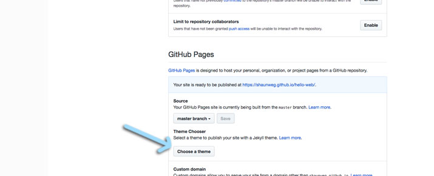

### 2018 Summer Code Camp
# Web Design

#### Monday

###### Opening Videos

###### Getting Started with GitHub Pages
- [x] Create a GitHub Account
- [x] Go to your Profile
- [x] You should see...
- [x] Create and Initialize a New Repository
- [x] Confirm you're in your repository
- [x] Go to the Settings of your Repository
- [x] Enable Github Pages
- [x] Confirm your GitHub Page is working!
- [x] Edit the README.md file

***

### Getting started with GitHub Pages
#### Add a theme
> Your *Hello Web* page probably looks pretty plain

> However, this page here looks much nicer, 

> even though it is also created in *GitHub Pages* with *Markdown*.

> The difference is, this page is in a repository with a theme.

***
> **Go back** to your *repository page*, and **click** *setting* on the right side

> **Scroll down** to where we found GitHub Pages, and **click** *Choose* a theme

> There's a handful of different themes you can select.

> Choose which ever you like best.

***

> In your repository, you'll notice a new file:
> - _config.yml
> This file tells GitHub Pages what styles to use with your page.

***

> - [next](monday-getting-10.md)

- [ ] Try viewing your GitHub page again
- [ ] Think about Design

***

###### Intro to HTML

***
