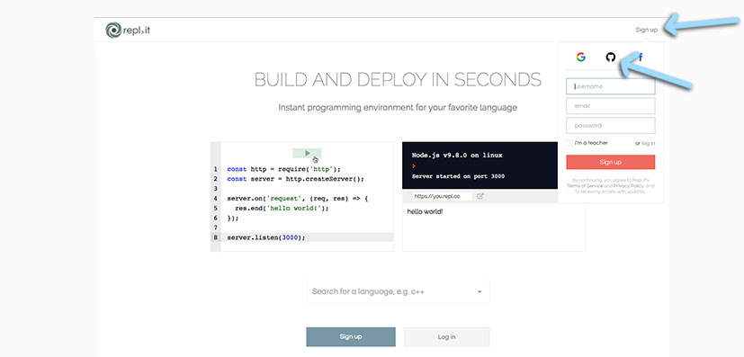

### 2019 Summer Code Camp
# Web Design

#### Tuesday

###### [Opening Videos](tuesday-opening-videos.md)

###### Intro to HTML

- [ ] Create a Hello World page with Text Edit
- [ ] Understanding Tags
- [ ] Try HTML with Repl.it

***

#### Follow along to create a Hello World Page with plain text editor

> [Video: A Hello World with TextEdit on a Mac](https://www.youtube.com/watch?v=M86sqTkw1Ek)

> [Video: Adding HTML tags to our Hello World](https://www.youtube.com/watch?v=QjkobGJjFSE)

***

#### Understandng Tags

> [Video: Understanding Tags](https://www.youtube.com/watch?v=208a6ZLpEgw)

***

**Try HTML with Repl.it** 

> First, **go to** *[Repl.it](https://repl.it)*.

> In the top left of your browser, **click** *Sign Up*.

***

> From the drop down menu, there are your expected boxes.

> However, notice the little icons about that?

> You can also sign up using: 
> - a Google Account
> - a GitHub Account
> - a Facebook Account

> **See** the *black circle with the cat* in it?

> **Click it** to sign up with *GitHub*.

***

> After authorizing, you'll see a screen with a box at the top.

> Repl.it isn't just for HTML, you can work with tons of different languages in it.

> In that box, **type in** *HTML* to start creating an HTML, CSS, & JS document in Repl.it

***

> On the screen, you'll see a series of panels.

> In the middle panel, there's already a chunk of code.

> In this section, you can start modifying the code. 

***

> **Try adding something** between the *body tags*.

> Once you've modified the code, **click** the *run* button.

> **Try making** a *page with the code*.

***

#### Understandng Tags

> [Video: Understanding Tags](https://www.youtube.com/watch?v=208a6ZLpEgw)

***

**Intro to CSS** 

> The next web language to look at is CSS

> HTML is what you use to create the content

> If you have a website about cats, the HTML is the content, 

> it tells the browser what to load, including:
> - text
> - photos
> - links

> HTML doesn't tell the browser how it should look though.

> CSS is what tells the browser how it should look.

> If a webpage looks nice, its because of CSS.

***

> **Watch** this *explanation on HTML, CSS, and JS*.

> video: [HTML, CSS, JavaScript Explained](https://www.youtube.com/watch?v=gT0Lh1eYk78)

***

> There are multiple ways we can start understanding CSS.

> The easiest is probably adding style tags directly into our HTML page.

> **Follow** along with *this video*.

> video: [Inline styles with HTML](https://www.youtube.com/watch?v=dFgpxpTf7lw)

***

## End.

> - [go back to Tuesday](tuesday.md)

***
